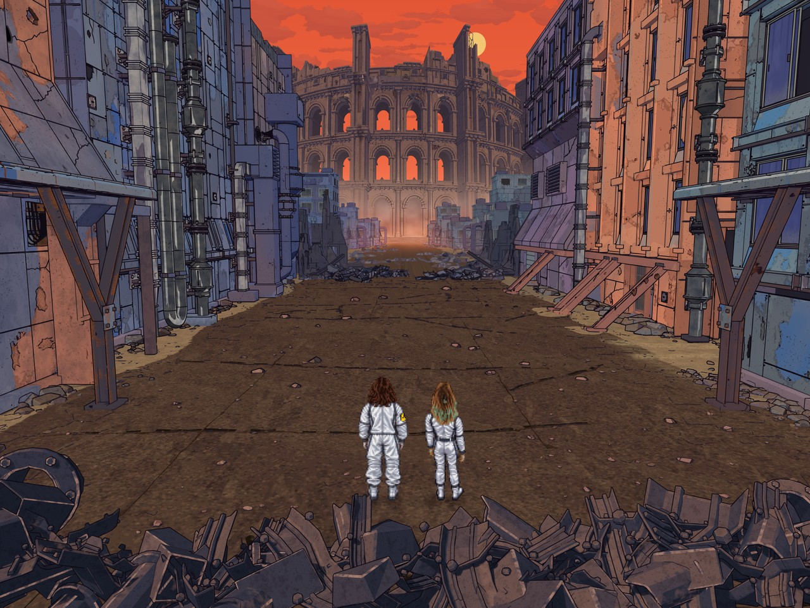

# Transmissions from Alpha Centauri

A ruined city street beneath an orange sky. Two travelers face a vast, weathered Colosseum, surrounded by broken buildings, exposed pipes, and scattered steel.

This is an illustrated scene built in Blender: editable 3D architecture and materials, expressive ink outlines, layered weathering, and two carefully preserved pixel-art characters. **Version 1.0 is complete.**

[](https://github.com/jhurliman/transmissions-from-alpha-centauri/releases/download/v1.0.0/main-4k.png)

*Click the image for the full 3840 × 2885 render.*

## Explore the project

- **See the finished artwork:** [download the 4K PNG](https://github.com/jhurliman/transmissions-from-alpha-centauri/releases/download/v1.0.0/main-4k.png).
- **Open the editable scene:** [download the complete v1.0 project](https://github.com/jhurliman/transmissions-from-alpha-centauri/releases/download/v1.0.0/transmissions-from-alpha-centauri-v1.0.0.zip). It includes the real Blender file, packed textures, render scripts, and documentation.
- **Understand how it is preserved:** read the [reproduction guide](docs/release/REPRODUCING.md), [project review](docs/release/REVIEW.md), and [asset provenance](docs/release/PROVENANCE.md).

The environment uses native geometry and materials, with native-derived cloud layers and authored soil textures. The characters, Airam and Miranda, are selected 2D pixel-art assets composited into the scene. Their exact colors and pixels are preserved by the render workflow.

This release is an illustration and editable art project. It is not a playable game or a working Space Quest patch. The compact repository contains the finished scene and what is needed to render it; the much larger archive of experiments, private photographs, and third-party reference collections is excluded.

## Render it yourself

Use **Blender 5.2.1 LTS, build `9e2066aef7ef`** for the tested result. The [v1.0 release](https://github.com/jhurliman/transmissions-from-alpha-centauri/releases/tag/v1.0.0) also includes the original macOS ARM64 Blender application for preservation. Other platforms and Blender versions have not been verified.

Download and extract the complete project ZIP above, or clone with [Git LFS](https://git-lfs.com/) installed:

```sh
git lfs install
git clone https://github.com/jhurliman/transmissions-from-alpha-centauri.git
cd transmissions-from-alpha-centauri
git lfs pull
```

Check the files with Python 3.9 or later:

```sh
python3 tools/release/verify.py
```

Then render into a new output folder:

```sh
blender -b --disable-autoexec --python-exit-code 1 -t 0 \
  --python releases/v1.0.0/render.py -- --output /tmp/tfac-v1-render
```

On macOS, you may need to replace `blender` with `/Applications/Blender.app/Contents/MacOS/Blender`. Choose an output folder that does not already exist.

The script restores the ink-rendering rules, renders the full scene, and leaves the saved scene unchanged. Those rules are why this launcher is needed instead of simply opening the file and pressing Render. Rendering uses Blender's bundled Python and packed assets; no AI service, pip installation, purchased-game data, or private source photos are needed.

A clean-checkout render completed in about nine minutes on the original M2 Max MacBook Pro. Allow longer on other systems; ink rendering can take a substantial part of the time.

## Keeping the artwork reproducible

The frozen `v1.0.0` tag and release archives preserve the original capture. The main branch can receive documentation and tooling updates. All 17 file-backed scene images are packed, and the scene's render runtime is included.

For the exact finished image, keep the released PNG. Re-rendering is tested, but different GPU drivers or future Blender versions may produce small differences. GitHub's automatic source archives may contain only a Git LFS pointer for the scene: use the **complete project ZIP** attached to the release for a self-contained backup.

The release includes checksums and recovery instructions. Keep an independent backup in addition to GitHub. Statements about missing remote backup in the original review describe the capture before it was published here.

## License

The license is being decided. The intent is to make the project available under a copyleft license while keeping commercial art creation possible. No GPL or AGPL license has been applied yet; this paragraph is not a license grant. Asset origins and third-party boundaries are recorded in the [provenance notes](docs/release/PROVENANCE.md).
